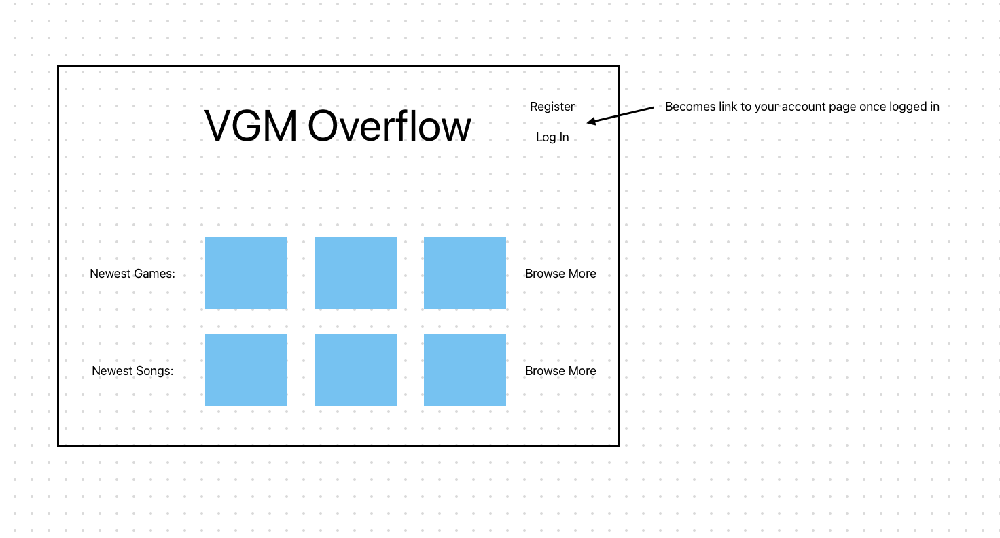
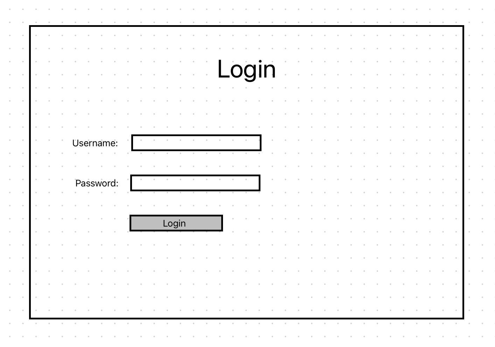
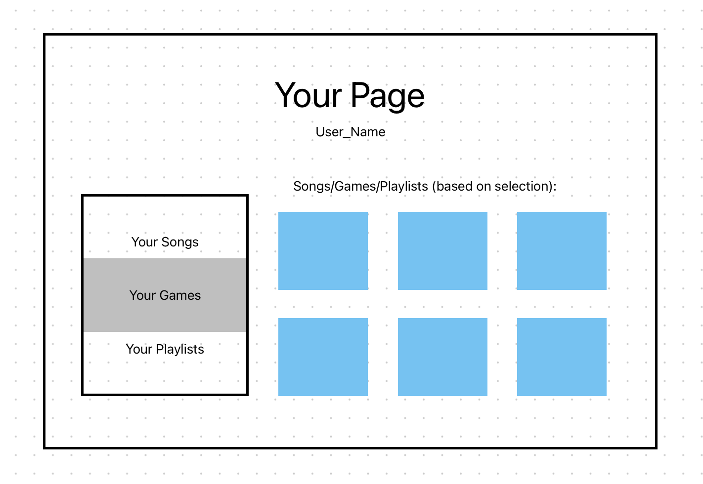
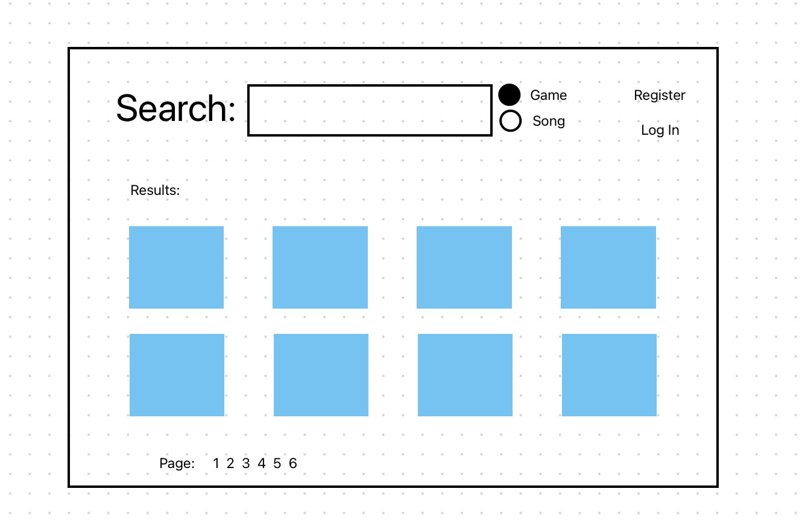
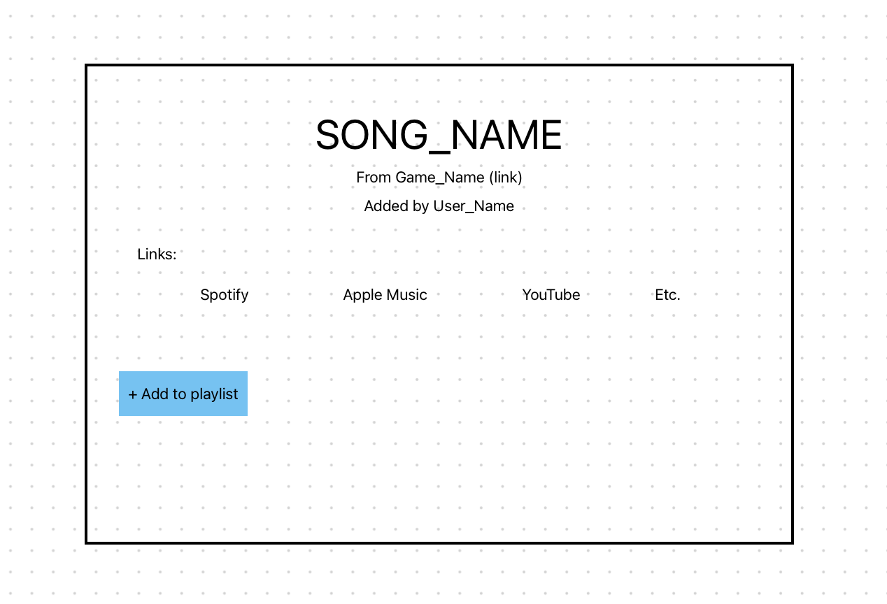
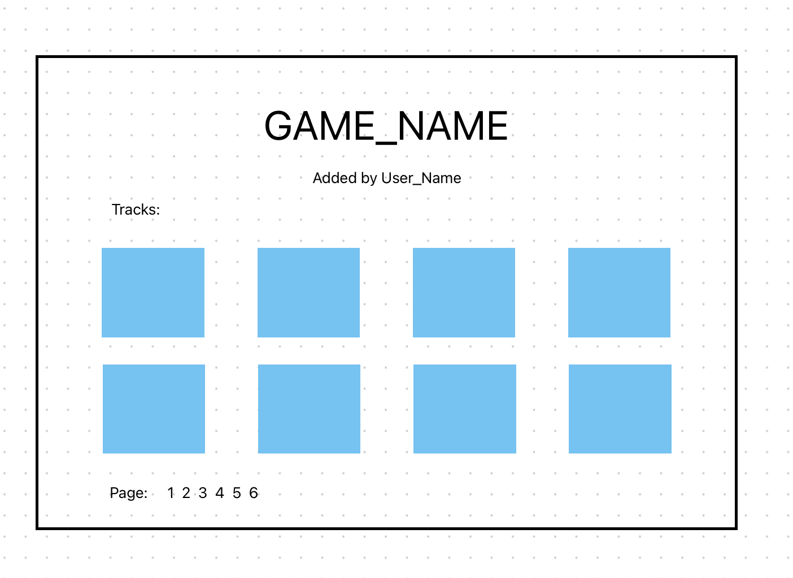
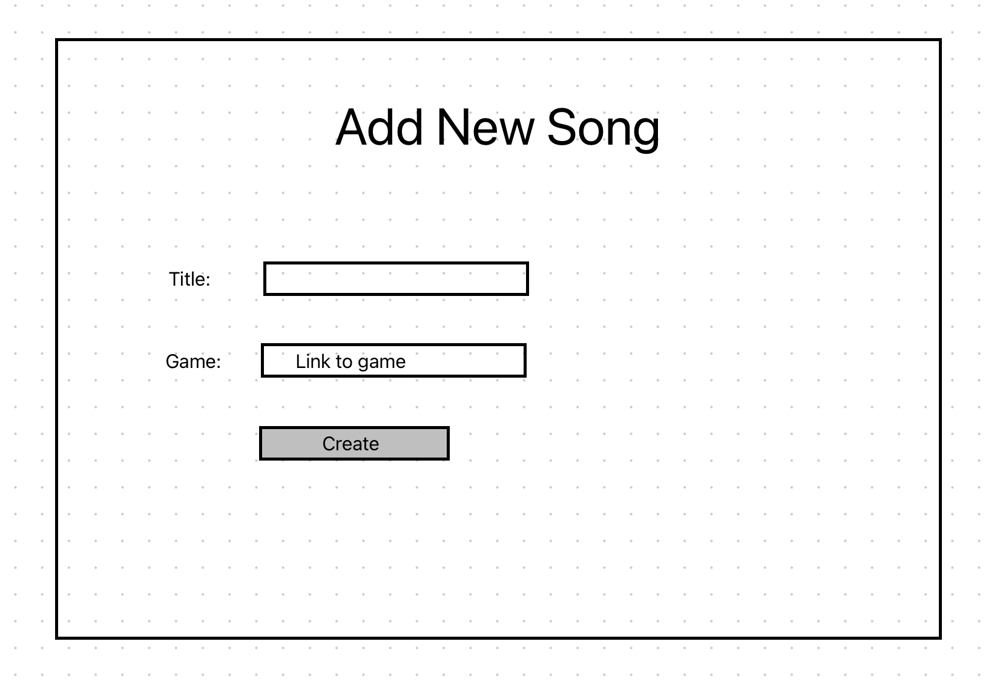
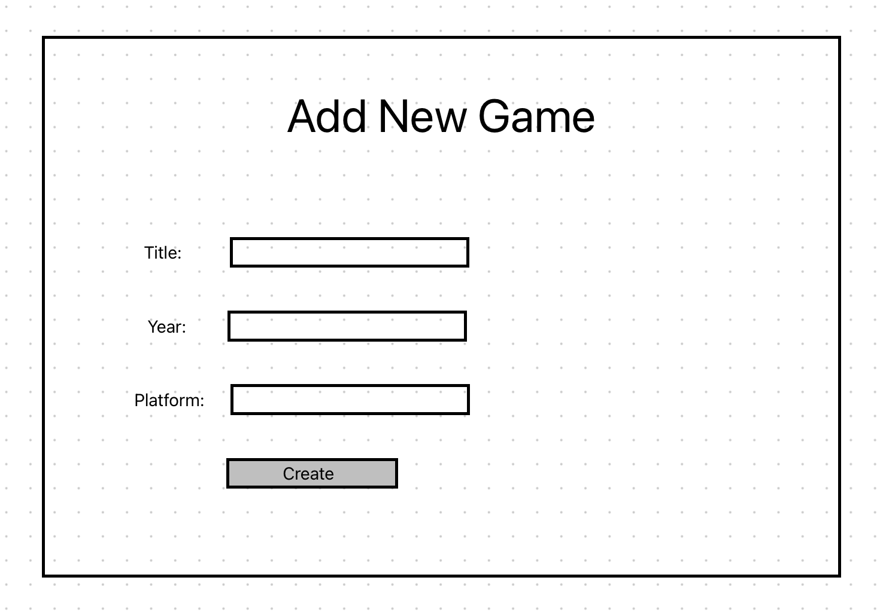
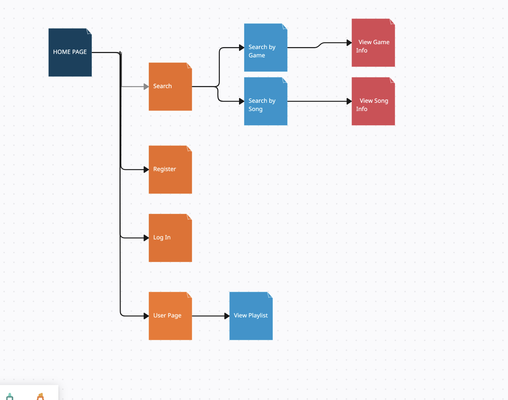

# VGM Overflow 

## Overview

While video games are thought of as a primarily visual medium, music is often what stays with us
longest after playing a game. Unforunately, many game developers make it incredibly difficult to
access their music, releasing it on specific streaming services, or only a few tracks at a time.
That's why I want to create VGM OVerflow, away for users to document the music of their favorite
games and provide links to various songs. Users will be able to add a game to the site, add songs
to its soundtrack, and create and share playlists of their own. In addition, everybody will be able
to search or browse by game, song, or playlist title.

## Data Model

The application will store Users, Songs, Games, and Playlists
These schemas are outlined in more detail in dbExample.mjs.

* each user will have a reference to all songs and games they've added and plalists they've made
* each song will have a reference to the game it's from, and a reference to the user that added it
* each game will have a list of songs in its soundtrack, and a reference to the user that added it
* each playlist will have a list of songs, and a reference to the user that added it

## [Link to Commented First Draft Schema](documentation/dbExample.mjs) 

## Wireframes

/home - home page, a hub for searching, registering, logging in , etc

/login - place for registered users to log in

/register - place for non-registered users to create an account

/yourpage - place for users to view their songs, games, playlists

/search - place for users to search by game or by song

/viewsong - place for users to view a song and its links

/viewgame - place for users to view a game and its soundtrack

/newsong - place for users to add a new song not already on the site

/newgame - place for users to view a new game not already on the site

## Site map

## User Stories or Use Cases

1. as non-registered user, I can register a new account with the site
2. as a user, I can log in to the site
3. as a user, I can add a new game
4. as a user, I can add a new song to a game
5. as a user, I can create a new playlist
6. as a user, I can view my playlists
7. as a user, I can view songs I added
8. as a user, I can view games I added
9. as a user, I can delete songs I added
10. as a user, I can delete games I added

## Research Topics

* (4 points) Youtube API
* 
* (2 points) Use a CSS framework (tailwind.css)
* (2 points) Integrate ESLint into my workflow

## [Link to Initial Main Project File](app.mjs) 

